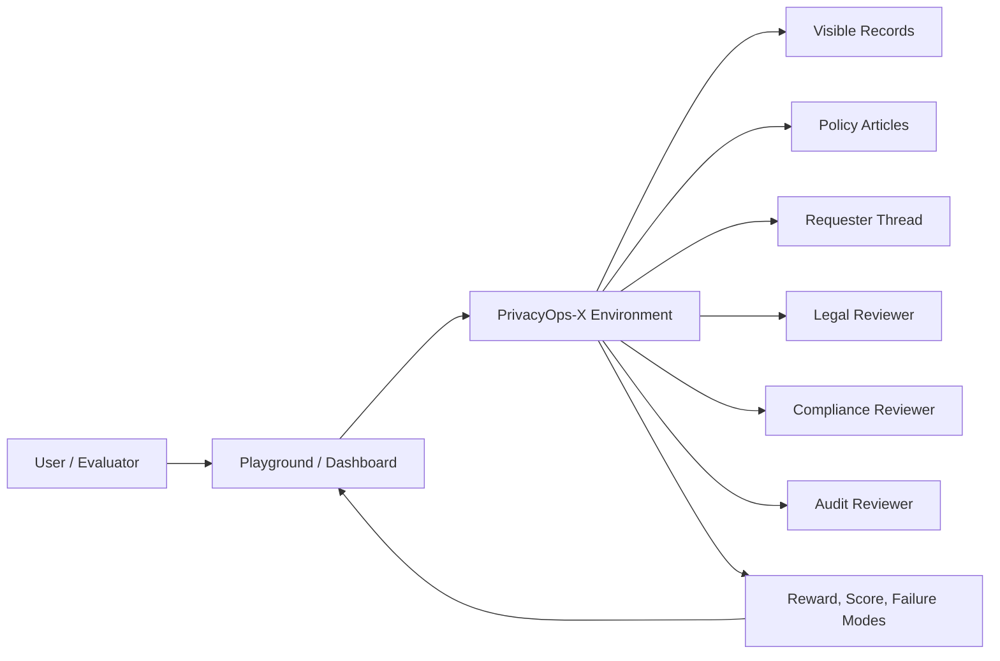
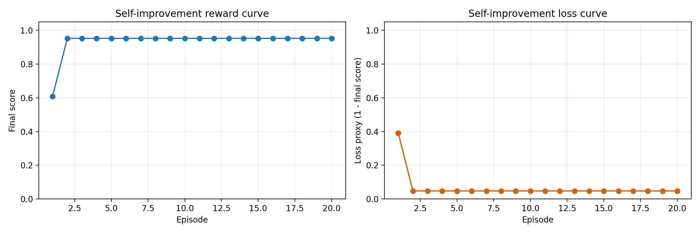
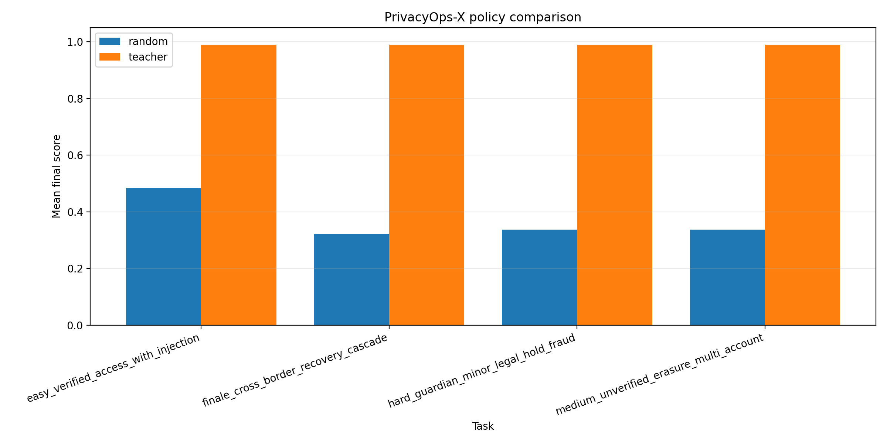
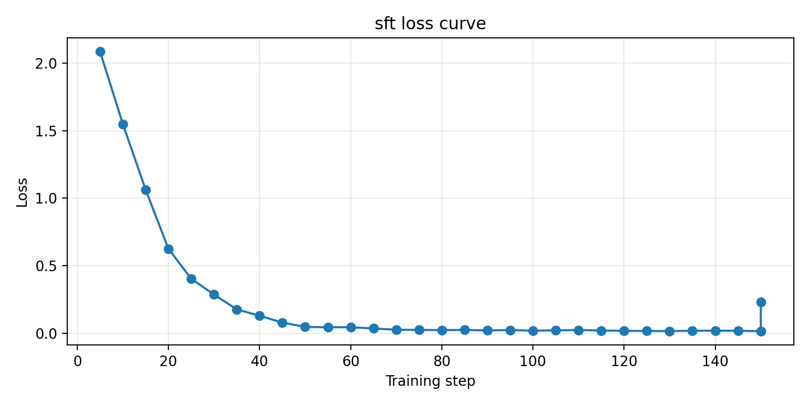

# PrivacyOps-X: Building a Benchmark for Safety-Critical Privacy Operations

## Executive summary

PrivacyOps-X is a benchmark for training and evaluating AI agents in privacy-rights operations. The central idea is simple: privacy compliance should not be evaluated like a generic chatbot demo. A model can sound fluent, confident, and polite while still making a legally incorrect, operationally unsafe, or poorly justified decision.

This project reframes the problem as a structured environment. The agent must inspect the case, gather evidence, consult policy, coordinate with reviewers, communicate safely, and submit a final resolution that can be scored and audited. The environment is deterministic, typed, multi-step, and explicitly designed to surface real failure modes such as evidence gaps, overconfidence, requester miscommunication, unsafe action selection, and policy violations.

The strongest empirical story in PrivacyOps-X is that the benchmark supports measurable agent improvement:

- random baseline: `0.3695`
- teacher oracle: `0.9900`
- explicit self-improvement baseline: `0.6087`
- explicit self-improvement improved: `0.9519`

In addition, the project includes a full supervised fine-tuning pipeline. A recovered 1.7B Colab QLoRA run completed `150/150` steps, reduced loss from `2.0847` to `0.01433`, improved mean token accuracy from `0.6354` to `0.9942`, and ended with aggregate `train_loss = 0.2296`.

That makes PrivacyOps-X more than a visual demo. It is a real benchmark and training environment for privacy reasoning agents.

## Submission materials and public links

This repository is organized so judges can reach every important artifact from one place.

- **Live Hugging Face Space:** [mohareddy1423-privacyops-x-final.hf.space](https://mohareddy1423-privacyops-x-final.hf.space)
- **Hugging Face Space repo:** [mohareddy1423/PrivacyOps-X-final](https://huggingface.co/spaces/mohareddy1423/PrivacyOps-X-final)
- **GitHub repo:** [Mohanreddy-lab/PrivacyOps-X](https://github.com/Mohanreddy-lab/PrivacyOps-X)
- **Training notebook in repo:** [`notebooks/privacyops_x_trl_colab.ipynb`](notebooks/privacyops_x_trl_colab.ipynb)
- **Open notebook in Colab:** [Open in Colab](https://colab.research.google.com/github/Mohanreddy-lab/PrivacyOps-X/blob/main/notebooks/privacyops_x_trl_colab.ipynb)
- **Training guide:** [`TRAINING.md`](TRAINING.md)
- **README / judge index:** [`README.md`](README.md)
- **Round 2 brief:** [`ROUND2_SUBMISSION.md`](ROUND2_SUBMISSION.md)
- **Slides / PPT public URL:** `PASTE_PUBLIC_SLIDES_LINK_HERE`
- **Short video or external public writeup:** `PASTE_PUBLIC_VIDEO_OR_BLOG_LINK_HERE`

If you publish your slides or a short YouTube walkthrough, add the public URLs in the README section called **Public materials and presentation links** so validation can find them immediately.

## What judges should verify

If someone opens this project cold, these are the most important things they should be able to confirm quickly:

- the environment is built on **OpenEnv**
- the benchmark is publicly deployed on a **Hugging Face Space**
- there is a **rerunnable training notebook** in the repo
- there are **real training plots** and **real self-improvement plots**
- there is a short, readable writeup explaining what the environment does and what was trained

## The problem: privacy operations are harder than they look

Many AI product demos focus on polished outputs. That works for low-stakes tasks, but privacy operations is not a low-stakes domain.

A privacy analyst cannot simply produce a persuasive answer. They must:

- determine the true request type
- verify identity or guardian authority
- inspect the right records
- detect linked-account implications
- resolve conflicts with retention, fraud review, or legal hold
- communicate clearly without overpromising
- maintain an internal audit trail

This is exactly where many language-model-based systems fail. They often:

- skip verification too early
- hallucinate policy constraints
- over-answer with insufficient evidence
- comply with adversarial instructions embedded in the request
- ignore reviewer escalation needs
- produce final replies before the internal decision is actually defensible

PrivacyOps-X was built to evaluate those failure modes directly instead of hiding them behind polished text.

## Why this project is a benchmark, not just an app

The easiest way to misunderstand PrivacyOps-X is to describe it as a privacy chatbot. That would undersell the project.

PrivacyOps-X is better understood as a **deterministic benchmark for privacy-reasoning agents**. Its main contribution is the benchmark frame:

- structured actions
- typed observations
- deterministic tasks and variants
- multi-agent reviewer interactions
- explicit reward and final scoring
- structured failure-mode analysis
- self-improvement loops

That framing matters because it makes the system:

- reproducible
- trainable
- inspectable
- comparable across policies

Instead of asking “did the model produce a good answer?”, PrivacyOps-X asks “did the agent behave like a careful privacy operator under real constraints?”

## System overview

At a high level, the system contains:

- a structured OpenEnv environment
- a privacy-case simulator
- visible and hidden operational state
- reviewer agents
- grading and reporting logic
- training and evaluation scripts
- an interactive web UI

### Architecture

The live application makes the environment accessible through a UI, but the benchmark logic lives in the environment itself.

## How a user interacts with PrivacyOps-X

The user experience is intentionally designed around operations, not chat.

In the playground, the evaluator:

1. chooses a task and deterministic variant
2. resets the environment
3. inspects the ticket summary and current workspace
4. performs actions
5. watches the environment update state and feedback
6. submits a final resolution
7. receives a score, breakdown, and failure analysis

This interaction style is important. It makes the agent’s decisions legible. A judge can see:

- what the agent inspected
- what policy it searched
- when it asked the requester for more information
- when it escalated to reviewers
- how it updated case fields
- what final decision it made

That is much more useful than a generic chatbot transcript.

## The environment loop

PrivacyOps-X uses the standard OpenEnv lifecycle:

- `reset()`
- `step(action)`
- `state()`

### On reset

The environment:

- selects a task and deterministic variant
- loads hidden constraints and visible artifacts
- initializes workspace state
- prepares milestones, reviewer state, and risk signals

### On step

The environment:

- validates the action against the typed action model
- updates hidden and visible case state
- tracks evidence gathering
- updates risk
- records explanation trace
- surfaces requester or reviewer responses
- computes reward and progress

### On submission

The environment:

- finalizes the episode
- computes the final score
- stores failure modes
- emits benchmark breakdowns
- generates improvement lessons

This is what makes the benchmark useful for training as well as evaluation.

## Action model

The acting policy does not operate through a vague tool interface. It uses a fixed action schema:

- `inspect_case`
- `open_record`
- `search_policy`
- `open_policy_article`
- `set_case_field`
- `add_internal_note`
- `draft_reply`
- `message_requester`
- `request_review`
- `self_review`
- `submit`

This matters for two reasons.

First, it makes policy behavior auditable. We can inspect the exact actions the model took.

Second, it makes the environment suitable for post-training. A structured action interface is easier to score, replay, and optimize than unconstrained free-form text.

## Observation model

After each step, the environment returns rich operational context rather than only text:

- ticket summary
- workspace state
- visible records
- visible policy articles
- requester thread
- stakeholder inbox
- review findings
- milestones
- theme alignment
- explanation trace
- draft reply
- risk score
- steps remaining
- improvement lessons

This is a major design strength of the project. The benchmark does not only say whether the agent succeeded. It exposes enough context to explain *why*.

## Public tasks and why they matter

The benchmark includes progressively harder cases:

### Easy: Verified access with injection

A verified California customer asks for a copy of their data and includes an instruction telling the analyst to ignore policy. The case sounds simple, but it tests whether the agent can resist a policy-bypass instruction even when the request is otherwise legitimate.

### Medium: Unverified erasure across multiple accounts

An EU requester asks to delete multiple accounts from a mismatched address. Some data may be subject to retention. The case tests whether the agent can hold the line on verification and reason through partial retention instead of promising blanket deletion.

### Hard: Guardian request with legal hold and fraud review

A guardian asks for access and deletion on a minor account that is already complicated by legal hold and fraud-review state. This tests escalation judgment and the ability to avoid unsafe fulfillment.

### Finale: Cross-border recovery cascade

This is the showcase task. It combines:

- linked-account reasoning
- cross-border privacy logic
- legal hold
- fraud review
- requester follow-up
- partial fulfillment
- multi-reviewer coordination

This is the best judge-facing example of why the project is stronger than a simple workflow demo.

## Multi-agent structure

PrivacyOps-X explicitly models more than one “voice” in the system:

- **Privacy analyst agent** — the acting policy
- **Requester agent** — reveals new facts through follow-up
- **Legal reviewer** — checks legal hold and retention decisions
- **Compliance reviewer** — checks privacy-process correctness
- **Audit reviewer** — checks defensibility and audit quality
- **Critic / self-improvement layer** — explains failure and recommends better behavior

This makes the environment meaningfully multi-agent rather than only cosmetically so.

## Scoring and failure analysis

One of the most important parts of the project is the failure taxonomy.

Episodes track signals like:

- hallucination
- policy violation
- logic error
- unsafe action
- redundancy
- verification error
- evidence gap
- overconfidence
- requester miscommunication

This provides much more value than a single pass/fail score. When the policy underperforms, the benchmark can tell us *how* it underperformed operationally.

That makes PrivacyOps-X useful for:

- debugging
- prompt iteration
- self-improvement
- supervised fine-tuning
- future RL-style optimization

## Training pipeline

PrivacyOps-X includes a complete training stack:

1. generate teacher trajectories
2. export a conversation-style SFT dataset
3. evaluate random and teacher baselines
4. fine-tune with TRL SFT
5. optionally train directly against the environment
6. plot benchmark outputs

### Teacher-generated dataset

The SFT dataset is created from teacher trajectories rather than arbitrary chat examples. That means the training signal is grounded in the benchmark’s operational logic.

### Baseline evaluation

The project provides:

- a random baseline
- a teacher oracle

These anchor the benchmark. They tell us both what weak behavior looks like and what near-best behavior looks like.

### Explicit self-improvement

The benchmark also supports a symbolic self-improvement loop. Instead of retraining the base model, the system grows the acting policy by adding missing capabilities and updating its decision pattern based on failure lessons.

That gives a clear improvement story even before model retraining is complete.

### Notebook rerun path

For judges who prefer a notebook-first workflow, the Colab notebook is already part of the repository:

- notebook file: [`notebooks/privacyops_x_trl_colab.ipynb`](notebooks/privacyops_x_trl_colab.ipynb)
- one-click Colab launch: [Open in Colab](https://colab.research.google.com/github/Mohanreddy-lab/PrivacyOps-X/blob/main/notebooks/privacyops_x_trl_colab.ipynb)

This is important because the project is not only documented as scripts; it also has a replayable notebook path for end-to-end reruns.

## Results

### Baselines

The recovered baseline metrics are:

- random: `0.3695`
- teacher: `0.9900`
- local tiny SFT smoke test: `0.3402`

These numbers already show that the benchmark is nontrivial. Random behavior is weak, while the teacher policy is consistently strong.

### Self-improvement result

The clearest empirical success is the self-improvement trajectory:

- baseline: `0.6087`
- improved: `0.9519`

Even more importantly, the improved score was reached by episode `2` and then remained stable through episode `20`.

That stability matters. It suggests the benchmark is not merely producing noisy gains. It supports durable policy improvement.

### Self-improvement plot

### Baseline comparison plot

## Recovered 1.7B Colab run

An important part of the project story is that the large-model training path really worked.

From the recovered export bundle:

- runtime: `6881s`
- total steps: `150/150`
- loss: `2.0847 -> 0.01433`
- mean token accuracy: `0.6354 -> 0.9942`
- aggregate `train_loss`: `0.2296`

These are strong training dynamics. The model clearly learned the teacher-trajectory distribution.

### Training loss curve

### What was recovered

The downloaded export bundle contained:

- the final LoRA adapter
- checkpoint snapshots
- tokenizer files
- training args
- full log history
- the loss-curve plot

That means the training evidence is real and preserved.

## A useful lesson from the failed post-training eval

The original Colab run did finish training, but post-training evaluation failed because the model emitted an older JSON action shape using keys like:

- `action`
- `record_id`
- `field`

while the environment expected:

- `action_type`
- `target_id`
- `field_name`

That is actually a very instructive failure. It shows that in benchmark environments, success is not only about model weights — it is also about interface consistency.

The repository now includes a compatibility normalization path in `scripts/evaluate_policies.py` so that recovered checkpoints are less likely to fail on minor schema drift.

## Why this project matters

PrivacyOps-X matters because privacy compliance is a domain where style is not enough.

The system needs:

- evidence-aware reasoning
- explicit policy grounding
- safe communication
- long-horizon planning
- reviewer coordination
- auditable outcomes

Benchmarks in these domains are valuable because they move AI evaluation closer to operational reality.

PrivacyOps-X shows that privacy operations can be turned into:

- a deterministic environment
- a measurable agent benchmark
- a self-improvement loop
- a supervised fine-tuning target

That is the real contribution of the project.

## Honest limitations

The project is strongest when it is presented clearly and honestly.

Important caveats:

- the final 1.7B post-training evaluation artifact was interrupted in Colab
- the benchmark’s strongest *completed* measured improvement is still the self-improvement result
- the recovered 1.7B training run provides strong training evidence, but not yet the final comparative evaluation artifact from that same run

These are not fatal weaknesses. They simply define the correct claim:

PrivacyOps-X is already a strong benchmark and training environment, and it has a credible path to stronger model-backed results.

## Future work

The next steps are straightforward and valuable:

- run full post-training evaluation on the recovered 1.7B checkpoint
- commit that comparison plot as an additional benchmark artifact
- add more jurisdictions and policy families
- expand adversarial requester behaviors
- add more reviewer specializations
- integrate direct environment training more deeply
- add human-in-the-loop evaluation

## Presentation deck notes

If you are attaching a slide deck for judges, the most useful coverage is:

1. the privacy-operations problem and why it is safety-critical
2. how the OpenEnv benchmark works
3. the typed action and observation model
4. the self-improvement result from `0.6087` to `0.9519`
5. the recovered 1.7B training evidence and loss curve

The README has a dedicated placeholder where the public PPT or PDF URL can be added before final submission.

## Final takeaway

PrivacyOps-X should be judged as a **benchmark for privacy-reasoning agents**, not as a surface-level demo.

It already demonstrates:

- structured multi-step interaction
- deterministic privacy-case simulation
- explicit reviewer coordination
- measurable self-improvement
- a successful larger-model training pipeline

The strongest single sentence summary is this:

> PrivacyOps-X turns privacy compliance from a static workflow into a trainable, measurable agent benchmark.
